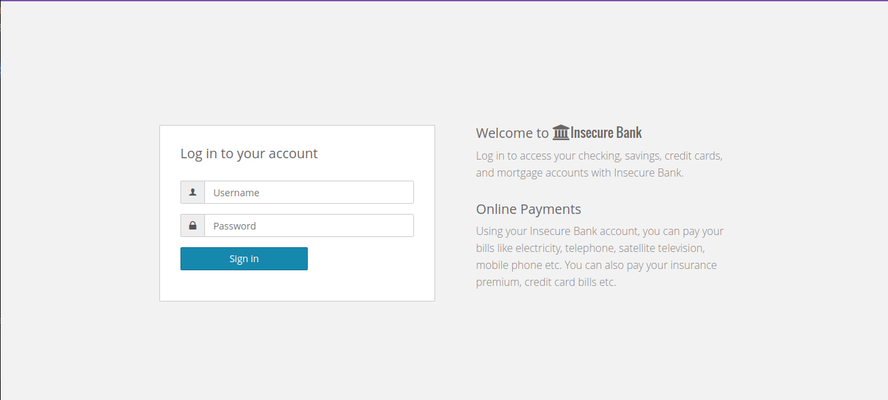

# Insecure bank
## Introduction
Insecure bank is a purposely insecure banking application to test vulnerability detection

## Vulnerabilities
### SQLi
First SQL injection can be triggered in the initial form (username: **john**, password: **test**)

